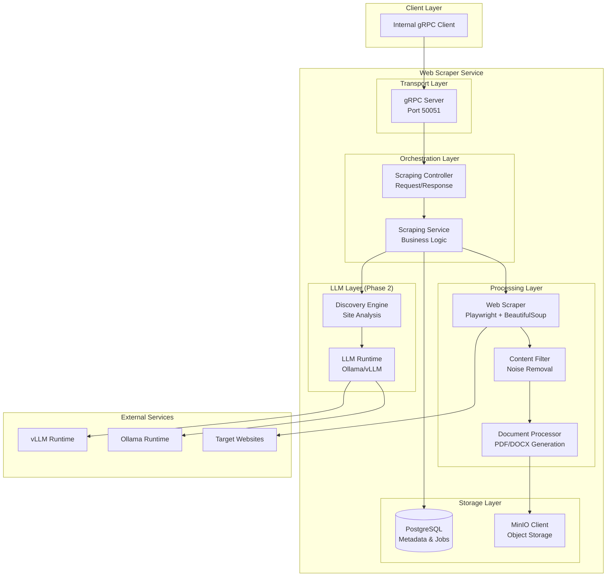
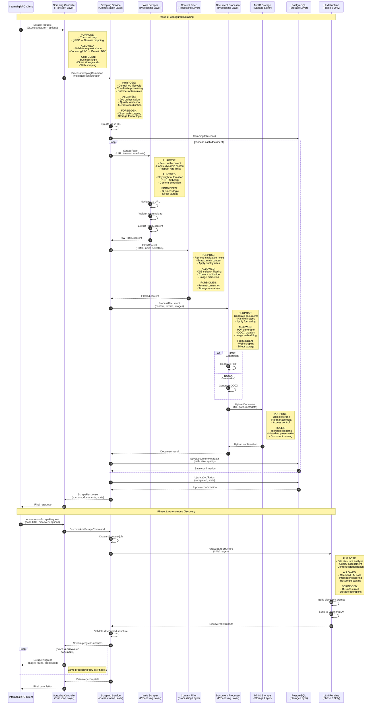
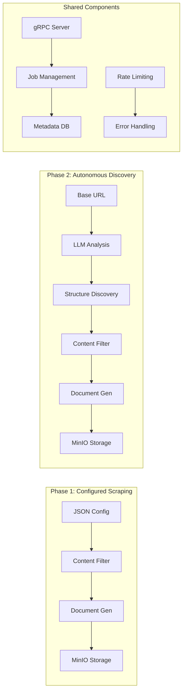

# Web Scraper Service

**Implementation Guidelines**

---

## 1. Project Setup & Structure

### 1.1 Repository Structure

```
web-scraper-service/
├── src/
│   └── scraper/
│       ├── __init__.py
│       ├── main.py                 # FastAPI entry point
│       ├── grpc_server.py          # gRPC server setup
│       ├── models/                 # Pydantic models
│       │   ├── __init__.py
│       │   ├── requests.py
│       │   ├── responses.py
│       │   └── database.py
│       ├── services/               # Business logic
│       │   ├── __init__.py
│       │   ├── scraper_service.py
│       │   ├── content_filter.py
│       │   ├── document_processor.py
│       │   └── discovery_service.py
│       ├── scraping/               # Web scraping layer
│       │   ├── __init__.py
│       │   ├── playwright_scraper.py
│       │   ├── beautifulsoup_scraper.py
│       │   └── content_extractor.py
│       ├── processing/             # Document processing
│       │   ├── __init__.py
│       │   ├── pdf_generator.py
│       │   ├── docx_generator.py
│       │   └── image_handler.py
│       ├── storage/                # Storage layer
│       │   ├── __init__.py
│       │   ├── minio_client.py
│       │   └── database.py
│       ├── llm/                   # LLM integration (Phase 2)
│       │   ├── __init__.py
│       │   ├── runtime.py
│       │   ├── ollama_adapter.py
│       │   ├── vllm_adapter.py
│       │   └── discovery_engine.py
│       └── utils/                  # Utilities
│           ├── __init__.py
│           ├── validators.py
│           ├── metrics.py
│           ├── logging.py
│           └── rate_limiter.py
├── proto/                          # Protocol Buffers
│   ├── scraper.proto
│   └── generated/
├── tests/                          # Test suite
│   ├── unit/
│   ├── integration/
│   └── fixtures/
├── config/                         # Configuration
│   ├── development.yaml
│   ├── production.yaml
│   └── scraping.yaml
├── scripts/                        # Development scripts
│   ├── setup.sh
│   ├── generate_proto.sh
│   └── test.sh
├── docker/
│   ├── Dockerfile
│   └── docker-compose.yml
├── migrations/                     # Database migrations
├── requirements.txt
├── pyproject.toml
└── README.md
```

### 1.2 Dependencies

```toml
# pyproject.toml
[project]
name = "web-scraper-service"
version = "0.1.0"
description = "Web Scraper Service for documentation extraction"
requires-python = ">=3.11"

[project.optional-dependencies]
dev = [
    "pytest>=7.4.0",
    "pytest-asyncio>=0.21.0",
    "black>=23.11.0",
    "isort>=5.12.0",
    "flake8>=6.1.0",
    "mypy>=1.7.0",
]

[tool.uv]
dev-dependencies = [
    "pytest>=7.4.0",
    "pytest-asyncio>=0.21.0",
    "black>=23.11.0",
    "isort>=5.12.0",
    "flake8>=6.1.0",
    "mypy>=1.7.0",
]

[tool.uv.sources]
# Add private indexes if needed

[[tool.uv.dependency-groups]]
name = "dev"
dependencies = [
    "pytest>=7.4.0",
    "pytest-asyncio>=0.21.0",
    "black>=23.11.0",
    "isort>=5.12.0",
    "flake8>=6.1.0",
    "mypy>=1.7.0",
]

[dependencies]
fastapi = "^0.104.0"
grpcio = "^1.58.0"
grpcio-tools = "^1.58.0"
playwright = "^1.40.0"
beautifulsoup4 = "^4.12.0"
weasyprint = "^60.0"
python-docx = "^1.1.0"
minio = "^7.2.0"
psycopg2-binary = "^2.9.0"
sqlalchemy = "^2.0.0"
alembic = "^1.12.0"
pydantic = "^2.5.0"
structlog = "^23.2.0"
prometheus-client = "^0.19.0"
aiohttp = "^3.9.0"
pillow = "^10.1.0"

[build-system]
requires = ["hatchling"]
build-backend = "hatchling.build"
```

---

## 2. Architecture Overview

### 2.1 System Architecture Diagram



### 2.2 Data Flow Diagram



### 2.3 Component Interaction Map



---

## 3. Core Implementation

### 2.1 gRPC Server Setup

```python
# src/scraper/grpc_server.py
import grpc
from concurrent import futures
import structlog
import scraper_pb2_grpc
from scraper.services.scraper_service import WebScraperService

logger = structlog.get_logger()

class ScraperServicer(scraper_pb2_grpc.WebScraperServicer):
    def __init__(self):
        self.scraper_service = WebScraperService()
    
    async def ScrapeDocuments(
        self, 
        request: scraper_pb2.ScrapeRequest, 
        context: grpc.aio.ServicerContext
    ) -> scraper_pb2.ScrapeResponse:
        logger.info("Received scrape request", job_id=request.job_id)
        
        try:
            return await self.scraper_service.scrape_documents(request)
        except Exception as e:
            logger.error("Scraping failed", job_id=request.job_id, error=str(e))
            context.set_code(grpc.StatusCode.INTERNAL)
            context.set_details(f"Internal error: {e}")
            return scraper_pb2.ScrapeResponse(success=False)
    
    async def DiscoverAndScrape(
        self,
        request: scraper_pb2.AutonomousScrapeRequest,
        context: grpc.aio.ServicerContext
    ):
        logger.info("Received discovery request", job_id=request.job_id)
        
        try:
            async for response in self.scraper_service.discover_and_scrape(request):
                yield response
        except Exception as e:
            logger.error("Discovery failed", job_id=request.job_id, error=str(e))
            context.set_code(grpc.StatusCode.INTERNAL)
            context.set_details(f"Discovery error: {e}")

async def serve():
    server = grpc.aio.server(futures.ThreadPoolExecutor(max_workers=10))
    scraper_pb2_grpc.add_WebScraperServicer_to_server(
        ScraperServicer(), server
    )
    server.add_insecure_port('[::]:50051')
    
    logger.info("Starting gRPC server on port 50051")
    await server.start()
    await server.wait_for_termination()
```

### 2.2 Service Layer Implementation

```python
# src/scraper/services/scraper_service.py
import asyncio
from typing import List
import structlog
from ..scraping.playwright_scraper import PlaywrightScraper
from ..services.content_filter import ContentFilter
from ..services.document_processor import DocumentProcessor
from ..storage.minio_client import MinIOClient
from ..storage.database import DatabaseManager

logger = structlog.get_logger()

class WebScraperService:
    def __init__(self):
        self.scraper = PlaywrightScraper()
        self.content_filter = ContentFilter()
        self.document_processor = DocumentProcessor()
        self.minio_client = MinIOClient()
        self.db_manager = DatabaseManager()
    
    async def scrape_documents(self, request) -> scraper_pb2.ScrapeResponse:
        """Process configured scraping request"""
        job_id = request.job_id
        
        logger.info("Starting configured scraping", job_id=job_id)
        
        # Update job status
        await self.db_manager.update_job_status(job_id, "running")
        
        try:
            documents = []
            errors = []
            total_pages = 0
            successful_pages = 0
            
            # Process each category/subcategory
            for category_name, category in request.structure.categories.items():
                for subcategory_name, subcategory in category.subcategories.items():
                    for url in subcategory.urls:
                        total_pages += 1
                        
                        try:
                            # Scrape page
                            page_content = await self.scraper.scrape_page(url)
                            
                            # Filter content
                            filtered_content = self.content_filter.filter_content(page_content)
                            
                            # Process document
                            category_path = [category_name, subcategory_name]
                            doc_result = await self.document_processor.process_document(
                                url, filtered_content, category_path, request.options
                            )
                            
                            documents.append(doc_result)
                            successful_pages += 1
                            
                            logger.info("Document processed", 
                                      url=url, 
                                      category_path=category_path)
                            
                        except Exception as e:
                            error_msg = f"Failed to process {url}: {e}"
                            errors.append(error_msg)
                            logger.error("Document processing failed", url=url, error=str(e))
            
            # Update job completion
            await self.db_manager.update_job_status(job_id, "completed")
            
            return scraper_pb2.ScrapeResponse(
                success=True,
                job_id=job_id,
                documents=[self._convert_to_pb_doc(doc) for doc in documents],
                errors=errors,
                stats=scraper_pb2.ProcessingStats(
                    total_pages_processed=total_pages,
                    successful_pages=successful_pages,
                    failed_pages=total_pages - successful_pages
                )
            )
            
        except Exception as e:
            await self.db_manager.update_job_status(job_id, "failed")
            raise
```

### 2.3 Content Filtering Implementation

```python
# src/scraper/services/content_filter.py
from bs4 import BeautifulSoup
from typing import List, Optional
import structlog

logger = structlog.get_logger()

class ContentFilter:
    def __init__(self, default_selectors: List[str] = None):
        self.noise_selectors = default_selectors or [
            "header", "footer", "nav", ".navigation", 
            ".sidebar", ".menu", ".breadcrumb",
            ".search", ".social-media", ".advertisement"
        ]
        self.content_selectors = [
            "main", "article", ".content", ".documentation",
            ".docs", ".main-content", "#content", ".markdown-body"
        ]
    
    def filter_content(self, soup: BeautifulSoup) -> BeautifulSoup:
        """Remove noise elements and return main content"""
        logger.debug("Filtering content", noise_selectors=len(self.noise_selectors))
        
        # Remove noise elements
        removed_count = 0
        for selector in self.noise_selectors:
            elements = soup.select(selector)
            for element in elements:
                element.decompose()
                removed_count += 1
        
        logger.debug("Removed noise elements", count=removed_count)
        
        # Find and return main content
        main_content = self._find_main_content(soup)
        if main_content:
            logger.debug("Found main content area")
            return main_content
        
        logger.warning("Could not identify main content, returning filtered page")
        return soup
    
    def _find_main_content(self, soup: BeautifulSoup) -> Optional[BeautifulSoup]:
        """Identify the main content area of the page"""
        for selector in self.content_selectors:
            content = soup.select_one(selector)
            if content and self._is_valid_content(content):
                return content
        return None
    
    def _is_valid_content(self, element) -> bool:
        """Check if element contains substantial content"""
        text = element.get_text(strip=True)
        return len(text) > 200  # Minimum content threshold
    
    def update_noise_selectors(self, selectors: List[str]):
        """Update noise selectors for specific job"""
        self.noise_selectors = selectors
        logger.info("Updated noise selectors", selectors=selectors)
```

### 2.4 Document Processing Implementation

```python
# src/scraper/services/document_processor.py
import asyncio
from pathlib import Path
from typing import List, Dict, Any
import structlog
from ..processing.pdf_generator import PDFGenerator
from ..processing.docx_generator import DOCXGenerator
from ..processing.image_handler import ImageHandler
from ..storage.minio_client import MinIOClient

logger = structlog.get_logger()

class DocumentProcessor:
    def __init__(self):
        self.pdf_generator = PDFGenerator()
        self.docx_generator = DOCXGenerator()
        self.image_handler = ImageHandler()
        self.minio_client = MinIOClient()
    
    async def process_document(
        self, 
        url: str, 
        content: str, 
        category_path: List[str],
        options
    ) -> Dict[str, Any]:
        """Process HTML content into document formats and upload to MinIO"""
        logger.info("Processing document", url=url, category_path=category_path)
        
        start_time = asyncio.get_event_loop().time()
        
        try:
            # Extract and process images
            images = await self.image_handler.extract_images(content, options.image_handling)
            
            # Generate documents
            files = {}
            if options.format in [OutputFormat.PDF, OutputFormat.BOTH]:
                pdf_path = await self.pdf_generator.generate(content, images)
                files['pdf'] = pdf_path
            
            if options.format in [OutputFormat.DOCX, OutputFormat.BOTH]:
                docx_path = await self.docx_generator.generate(content, images)
                files['docx'] = docx_path
            
            # Upload to MinIO
            minio_paths = {}
            for format_type, file_path in files.items():
                minio_path = await self._upload_to_minio(
                    file_path, url, format_type, category_path
                )
                minio_paths[format_type] = minio_path
            
            processing_time = (asyncio.get_event_loop().time() - start_time) * 1000
            
            logger.info("Document processed", 
                      url=url, 
                      processing_time_ms=processing_time,
                      formats=list(minio_paths.keys()))
            
            return {
                'minio_paths': minio_paths,
                'source_url': url,
                'processing_time_ms': int(processing_time),
                'category_path': category_path,
                'image_count': len(images)
            }
            
        except Exception as e:
            logger.error("Document processing failed", url=url, error=str(e))
            raise
    
    async def _upload_to_minio(
        self, 
        file_path: str, 
        source_url: str, 
        format_type: str,
        category_path: List[str]
    ) -> str:
        """Upload document to MinIO with proper path structure"""
        # Generate MinIO path
        url_hash = hash(source_url)
        category_str = "/".join(category_path) if category_path else "root"
        timestamp = int(asyncio.get_event_loop().time())
        minio_path = f"documents/{category_str}/{url_hash}_{timestamp}.{format_type}"
        
        await self.minio_client.upload_file(file_path, minio_path)
        
        # Clean up temporary file
        Path(file_path).unlink(missing_ok=True)
        
        return minio_path
```

---

## 3. Phase 2 LLM Integration

### 3.1 LLM Runtime Interface

```python
# src/scraper/llm/runtime.py
from abc import ABC, abstractmethod
from typing import Dict, Any

class LLMRuntime(ABC):
    """Abstract interface for LLM runtimes"""
    
    @abstractmethod
    async def complete(self, prompt: str, **kwargs) -> str:
        """Generate completion from LLM"""
        pass
    
    @abstractmethod
    async def analyze_site_structure(self, pages: List[str]) -> Dict[str, Any]:
        """Analyze site structure and return hierarchy"""
        pass

class LLMRuntimeFactory:
    @staticmethod
    def create(runtime_type: str, **config) -> LLMRuntime:
        if runtime_type == 'ollama':
            from .ollama_adapter import OllamaAdapter
            return OllamaAdapter(**config)
        elif runtime_type == 'vllm':
            from .vllm_adapter import vLLMAdapter
            return vLLMAdapter(**config)
        else:
            raise ValueError(f"Unsupported runtime type: {runtime_type}")
```

### 3.2 Ollama Adapter

```python
# src/scraper/llm/ollama_adapter.py
import aiohttp
import structlog
from .runtime import LLMRuntime

logger = structlog.get_logger()

class OllamaAdapter(LLMRuntime):
    def __init__(self, host: str = "localhost", port: int = 11434):
        self.base_url = f"http://{host}:{port}"
    
    async def complete(self, prompt: str, **kwargs) -> str:
        """Generate completion from Ollama"""
        logger.debug("Sending request to Ollama", prompt_length=len(prompt))
        
        async with aiohttp.ClientSession() as session:
            payload = {
                "model": kwargs.get("model", "qwen2.5:3b"),
                "prompt": prompt,
                "stream": False,
                "options": {
                    "temperature": kwargs.get("temperature", 0.1),
                    "max_tokens": kwargs.get("max_tokens", 4096)
                }
            }
            
            try:
                async with session.post(
                    f"{self.base_url}/api/generate",
                    json=payload,
                    timeout=kwargs.get("timeout", 300)
                ) as response:
                    result = await response.json()
                    return result.get("response", "")
                    
            except Exception as e:
                logger.error("Ollama request failed", error=str(e))
                raise
    
    async def analyze_site_structure(self, pages: List[str]) -> Dict[str, Any]:
        """Analyze site structure using Ollama"""
        prompt = self._build_discovery_prompt(pages)
        
        response = await self.complete(prompt)
        
        try:
            import json
            return json.loads(response)
        except json.JSONDecodeError as e:
            logger.error("Failed to parse LLM response", error=str(e))
            raise
    
    def _build_discovery_prompt(self, pages: List[str]) -> str:
        """Build prompt for site structure discovery"""
        pages_text = "\n\n".join([f"Page {i+1}:\n{page}" for i, page in enumerate(pages)])
        
        return f"""
        Analyze these documentation pages and identify the site structure:
        
        {pages_text}
        
        Please provide a JSON response with:
        1. Main categories and subcategories
        2. Document URLs for each category
        3. Navigation patterns
        4. Content quality assessment
        5. Recommended processing order
        
        Response format:
        {{
            "categories": {{
                "category_name": {{
                    "description": "Category description",
                    "subcategories": {{
                        "subcategory_name": {{
                            "description": "Subcategory description",
                            "documents": ["url1", "url2"]
                        }}
                    }}
                }}
            }},
            "quality_score": 0.8,
            "navigation_pattern": "pattern_description"
        }}
        """
```

---

## 4. Database Implementation

### 4.1 Database Models

```python
# src/scraper/models/database.py
from sqlalchemy import Column, String, Integer, Float, DateTime, JSON, Boolean
from sqlalchemy.ext.declarative import declarative_base
from sqlalchemy.dialects.postgresql import UUID
import uuid

Base = declarative_base()

class ScrapingJob(Base):
    __tablename__ = "scraping_jobs"
    
    id = Column(UUID(as_uuid=True), primary_key=True, default=uuid.uuid4)
    job_id = Column(String(255), unique=True, nullable=False)
    base_url = Column(String, nullable=False)
    job_type = Column(String(50), nullable=False)  # 'configured' or 'autonomous'
    status = Column(String(20), nullable=False, default='pending')
    configuration = Column(JSON, nullable=False)
    created_at = Column(DateTime, nullable=False)
    updated_at = Column(DateTime, nullable=False)
    started_at = Column(DateTime)
    completed_at = Column(DateTime)
    
    # Statistics
    total_pages = Column(Integer, default=0)
    successful_pages = Column(Integer, default=0)
    failed_pages = Column(Integer, default=0)
    total_processing_time_ms = Column(Integer, default=0)

class Document(Base):
    __tablename__ = "documents"
    
    id = Column(UUID(as_uuid=True), primary_key=True, default=uuid.uuid4)
    job_id = Column(String(255), nullable=False)
    source_url = Column(String, nullable=False)
    minio_path = Column(String, nullable=False)
    title = Column(String)
    file_size_bytes = Column(Integer)
    content_type = Column(String(100))
    processing_time_ms = Column(Integer)
    
    # Quality metrics
    text_to_noise_ratio = Column(Float)
    word_count = Column(Integer)
    image_count = Column(Integer)
    link_count = Column(Integer)
    content_density = Column(Float)
    
    # Metadata
    category_path = Column(JSON)  # Array of categories/subcategories
    extraction_timestamp = Column(DateTime)
    created_at = Column(DateTime, nullable=False)
```

### 4.2 Database Manager

```python
# src/scraper/storage/database.py
from sqlalchemy.ext.asyncio import create_async_engine, AsyncSession
from sqlalchemy.orm import sessionmaker
from ..models.database import ScrapingJob, Document
import structlog

logger = structlog.get_logger()

class DatabaseManager:
    def __init__(self, database_url: str):
        self.engine = create_async_engine(database_url)
        self.async_session = sessionmaker(
            self.engine, class_=AsyncSession, expire_on_commit=False
        )
    
    async def create_job(self, job_id: str, base_url: str, configuration: dict) -> ScrapingJob:
        """Create new scraping job"""
        async with self.async_session() as session:
            job = ScrapingJob(
                job_id=job_id,
                base_url=base_url,
                configuration=configuration
            )
            session.add(job)
            await session.commit()
            await session.refresh(job)
            return job
    
    async def update_job_status(self, job_id: str, status: str):
        """Update job status"""
        async with self.async_session() as session:
            await session.execute(
                update(ScrapingJob)
                .where(ScrapingJob.job_id == job_id)
                .values(status=status, updated_at=datetime.utcnow())
            )
            await session.commit()
    
    async def save_document(self, job_id: str, document_data: dict):
        """Save processed document metadata"""
        async with self.async_session() as session:
            doc = Document(
                job_id=job_id,
                **document_data
            )
            session.add(doc)
            await session.commit()
```

---

## 5. Configuration & Deployment

### 5.1 Configuration Management

```python
# src/scraper/config.py
from pydantic import BaseSettings
from typing import List

class Settings(BaseSettings):
    # Service
    service_port: int = 50051
    log_level: str = "INFO"
    
    # Database
    database_url: str
    database_pool_size: int = 20
    
    # MinIO
    minio_endpoint: str
    minio_access_key: str
    minio_secret_key: str
    minio_bucket: str = "scraped-documents"
    minio_secure: bool = False
    
    # LLM Runtime (Phase 2)
    llm_runtime_type: str = "ollama"  # 'ollama' or 'vllm'
    ollama_host: str = "localhost"
    ollama_port: int = 11434
    vllm_host: str = "localhost"
    vllm_port: int = 8000
    llm_model: str = "qwen2.5:3b"
    
    # Scraping
    default_timeout_seconds: int = 30
    max_concurrent_pages: int = 5
    rate_limit_per_second: int = 2
    user_agent: str = "WebScraper/1.0"
    
    # Quality thresholds
    min_text_ratio: float = 0.7
    min_word_count: int = 100
    max_word_count: int = 50000
    
    class Config:
        env_file = ".env"
        case_sensitive = False

settings = Settings()
```

### 5.2 Docker Configuration

```dockerfile
# docker/Dockerfile
FROM python:3.11-slim

# Install system dependencies
RUN apt-get update && apt-get install -y \
    wget \
    gnupg \
    ca-certificates \
    && rm -rf /var/lib/apt/lists/*

# Install Playwright browsers
RUN pip install playwright
RUN playwright install chromium
RUN playwright install-deps

# Set work directory
WORKDIR /app

# Copy requirements and install Python dependencies
COPY requirements.txt .
RUN pip install -r requirements.txt

# Copy application code
COPY . .

# Generate protobuf files
RUN python -m grpc_tools.protoc \
    --proto_path=proto \
    --python_out=src/scraper/proto/generated \
    proto/scraper.proto

# Create non-root user
RUN useradd --create-home --shell /bin/bash scraper
RUN chown -R scraper:scraper /app
USER scraper

# Expose port
EXPOSE 50051

# Health check
HEALTHCHECK --interval=30s --timeout=10s --start-period=5s --retries=3 \
    CMD python -c "import grpc; channel = grpc.insecure_channel('localhost:50051'); grpc.channel_ready(channel)"

# Run application
CMD ["python", "-m", "scraper.main"]
```

---

## 6. Testing Strategy

### 6.1 Unit Testing

```python
# tests/unit/test_content_filter.py
import pytest
from bs4 import BeautifulSoup
from src.scraper.services.content_filter import ContentFilter

class TestContentFilter:
    def test_removes_navigation_elements(self):
        html = """
        <html>
            <nav>Navigation Menu</nav>
            <main>
                <h1>Main Content</h1>
                <p>Important content here</p>
            </main>
            <footer>Footer content</footer>
        </html>
        """
        soup = BeautifulSoup(html, 'html.parser')
        filter = ContentFilter(["nav", "footer"])
        
        result = filter.filter_content(soup)
        
        assert result.select_one("nav") is None
        assert result.select_one("footer") is None
        assert result.select_one("main") is not None
        assert "Main Content" in result.get_text()
    
    def test_preserves_main_content(self):
        html = """
        <html>
            <div class="sidebar">Sidebar content</div>
            <article>
                <h1>Article Title</h1>
                <p>Article content with substantial text.</p>
            </article>
        </html>
        """
        soup = BeautifulSoup(html, 'html.parser')
        filter = ContentFilter([".sidebar"])
        
        result = filter.filter_content(soup)
        
        assert result.select_one(".sidebar") is None
        assert result.select_one("article") is not None
        assert len(result.get_text(strip=True)) > 50
```

### 6.2 Integration Testing

```python
# tests/integration/test_scraping_integration.py
import pytest
from src.scraper.services.scraper_service import WebScraperService
from src.scraper.storage.minio_client import MinIOClient
from src.scraper.storage.database import DatabaseManager

@pytest.mark.asyncio
class TestScrapingIntegration:
    async def test_end_to_end_scraping(self, test_minio, test_db):
        # Setup test environment
        minio_client = MinIOClient(**test_minio_config)
        db_manager = DatabaseManager(test_db_url)
        service = WebScraperService(minio_client, db_manager)
        
        # Create test request
        request = ScrapeRequest(
            job_id="test-job-123",
            base_url="http://localhost:8000/test-docs",
            structure={
                "getting-started": {
                    "installation": ["install.html"],
                    "quickstart": ["quickstart.html"]
                }
            },
            options=ScrapingOptions(
                format=OutputFormat.PDF,
                image_handling=ImageHandling.EMBED,
                noise_selectors=["nav", "footer"]
            )
        )
        
        # Execute request
        response = await service.scrape_documents(request)
        
        # Verify results
        assert response.success is True
        assert len(response.documents) == 2
        assert response.stats.successful_pages == 2
        assert response.stats.failed_pages == 0
        
        # Verify MinIO uploads
        for doc in response.documents:
            assert doc.minio_path.startswith("documents/getting-started/")
            assert doc.source_url.startswith("http://localhost:8000/test-docs/")
            assert doc.file_size_bytes > 0
```

---

## 7. Monitoring & Observability

### 7.1 Metrics Collection

```python
# src/scraper/utils/metrics.py
from prometheus_client import Counter, Histogram, Gauge
import time
import psutil

# Business metrics
scraping_jobs_total = Counter('scraper_jobs_total', 'Total scraping jobs')
pages_processed_total = Counter('pages_processed_total', 'Total pages processed')
documents_generated_total = Counter('documents_generated_total', 'Total documents generated')

# Performance metrics
processing_duration = Histogram('processing_duration_seconds', 'Document processing time')
scraping_duration = Histogram('scraping_duration_seconds', 'Page scraping time')

# System metrics
memory_usage = Gauge('memory_usage_bytes', 'Memory usage in bytes')
cpu_usage = Gauge('cpu_usage_percent', 'CPU usage percentage')

class MetricsCollector:
    @staticmethod
    def record_job_start(job_id: str):
        scraping_jobs_total.inc()
    
    @staticmethod
    def record_page_processed():
        pages_processed_total.inc()
    
    @staticmethod
    def record_document_generated():
        documents_generated_total.inc()
    
    @staticmethod
    def record_processing_time(duration: float):
        processing_duration.observe(duration)
    
    @staticmethod
    def update_system_metrics():
        process = psutil.Process()
        memory_usage.set(process.memory_info().rss)
        cpu_usage.set(process.cpu_percent())
```

---

## 8. Development Workflow

### 8.1 Local Development Setup

```bash
# Clone and setup
git clone <repository>
cd web-scraper-service

# Install dependencies with uv
uv sync --dev

# Setup development environment
cp .env.example .env
# Edit .env with local configuration

# Start dependencies
docker-compose -f docker/docker-compose.yml up -d

# Setup database
uv run alembic upgrade head

# Generate protobuf files
./scripts/generate_proto.sh

# Run tests
uv run pytest tests/ -v

# Start development server
uv run python -m scraper.main
```

### 8.2 Quality Checks

```bash
# Code formatting
uv run black src/ tests/
uv run isort src/ tests/

# Linting
uv run flake8 src/ tests/

# Type checking
uv run mypy src/

# Security scanning
uv run bandit -r src/

# Run all quality checks
uv run pre-commit run --all-files
```

This implementation guide provides comprehensive patterns and examples for building the Web Scraper Service following the established architecture and requirements.
